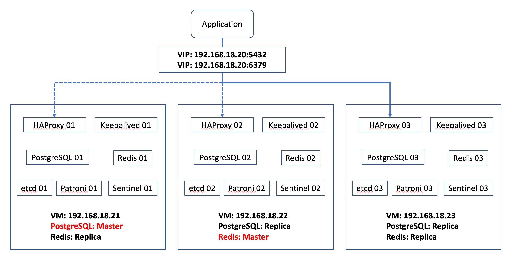
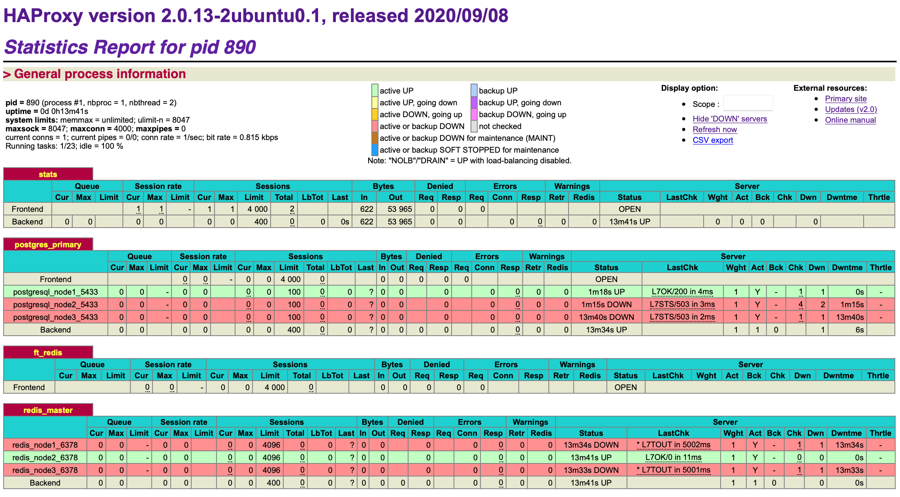

# Setup PostgreSQL and Redis HA (High Availability) clusters

The Centrify Hyper-scalable Privileged Access Service (Hyper-scalable PAS) requires Cache server (Redis) and Database server (PostgreSQL) as its backend. Both PostgreSQL and Redis need to be sized to meet scalability and high availability needs. This tutorial describes one of the way to setup PostgreSQL and Redis HA clusters using 3 Linux nodes.

## PostgreSQL High Availability

There are multiple tools available for managing the high availability (HA) of your PostgreSQL deployment clusters as described in PostgreSQL [High Availability, Load Balancing, and Replication](https://www.postgresql.org/docs/12/different-replication-solutions.html) documentation. In this tutorial, we will describe setting up PostgreSQL HA based on streaming replication and using [Patroni](https://github.com/zalando/patroni) for managing high availability of PostgreSQL clusters. Refer to [Managing High Availability in PostgreSQL](https://scalegrid.io/blog/managing-high-availability-in-postgresql-part-3/) for comparison against other HA tools.

Requirements for setting up PostgreSQL HA:
- **Linux OS** - To form a HA cluster, minimally 3 nodes (2n + 1) are required due to etcd requirement. The script provided in this tutorial supports CentOS 8.x and Ubuntu 20.x.
- **PostgreSQL** - To form a HA cluster, minimally 2 PostgreSQL instances are required. The script provided in this tutorial setup 3 instances of PostgreSQL 12.
- **etcd** - It is a Distributed Configuration Store (DCS) that Patroni keeps all of the vital data. Patroni also supports other DCS solutions like Zookeeper, Consul and Kubernetes. It provides the distributed decision-making mechanism that determines which Patroni instance should be the leader and which instances should be standbys. It is required to have at least three etcd nodes to ensure a majority during leader voting.
- **Patroni** - Patroni is an automatic failover system for PostgreSQL. It provides automatic or manual failover and keeps all of the vital data stored into a distributed configuration store (DCS). Patroni is used to create, manage, maintain, and monitor highly available clusters using Postgres streaming replication and handles the Postgres database initialization as well as planned switchovers or unplanned failovers. Patroni/PostgreSQL nodes are decoupled from DCS nodes and therefore there is no requirement on the minimal number of nodes. Running a cluster consisting of one master and one standby is perfectly fine. The script provided in this tutorial setup 3 instances of Patroni.
- **HAProxy** - In most cases, application isn't aware of the role of each database node and needs to communicate with primary (writeable) PostgreSQL node. The database connections from application do not happen directly to the database nodes but are routed via a connection proxy like HAProxy. This proxy, by querying the Patroni REST api, determines the primary node. To increase availability, minimally 2 HAProxy instances are required.  The script provided in this tutorial setup 3 instances of HAProxy.
- **Keepalived** - HAProxy sits between your application and database instances. It can unfortunately HAProxy also become a single point of failure, should it fail, there will be no route to the databases. To avoid such a situation, you can deploy multiple HAProxy instances. But then the question is - how to decide to which proxy host to connect to. Keepalived provides Virtual IP (VIP) for HAProxy. If the “active” HAProxy will become unavailable, VIP will be moved to another host automatically.

## Redis High Availability

High availability in Redis is achieved through master-slave replication. A master Redis server can have multiple Redis servers as slaves, preferably deployed on different nodes across multiple data centers. There are many high-availability tools available that can monitor and manage a master-slave replica configuration. However, the most common HA solution that comes bundled with Redis is [Redis Sentinel](https://redis.io/topics/sentinel). Redis Sentinels run as a set of separate processes that in combination monitor Redis master-slave sets and provide automatic failover and reconfiguration.

Requirements for setting up Redis HA:
- **Linux OS** - To form a HA cluster, minimally 3 nodes (2n + 1) are required due to Sentinel requirement. The script provided in this tutorial supports CentOS 8.x and Ubuntu 20.x.
- **Redis** - To form a HA cluster, minimally 2 Redis instances are required. The script provided in this tutorial setup 3 instances of Redis 6.
- **Sentinel** - Redis Sentinel provides monitoring, notifications, automatic failover and acts as a configuration provider for clients. Redis Sentinel is a distributed system and it is designed to run in a configuration where there are multiple Sentinel processes cooperating together. Similar to the role of etcd in PostgreSQL HA, you need at least 3 Sentinel instances for a robust deployment. The script provided in this tutorial setup 3 instances of Sentinel.
- **HAProxy** - In most cases, application isn't aware of the role of each Redis node and needs to communicate with master (writeable) Redis node. A single network connection endpoint for a master-slave set can be provided by HAProxy, by querying Redis nodes to determine the master node. To increase availability, minimally 2 HAProxy instances are required. The script provided in this tutorial setup 3 instances of HAProxy.
- **Keepalived** - HAProxy sits between your application and Redis instances. It can unfortunately HAProxy also become a single point of failure, should it fail, there will be no route to the Redis. To avoid such a situation, you can deploy multiple HAProxy instances. But then the question is - how to decide to which proxy host to connect to. Keepalived provides Virtual IP (VIP) for HAProxy. If the “active” HAProxy will become unavailable, VIP will be moved to another host automatically.

## Putting It Together

As a example, below is the environment we will use.

|  HA Node Name  |  Apps / Services  |  VM IP Address  | Virtual IP |
| ---- | ---- | --- | --- |
| Node 1 | PostgreSQL (Primary), etcd, Patroni, Redis, Sentinel (Replica), HAProxy (Backup), Keepalived | 192.168.18.21 |  |
| Node 2 | PostgreSQL (Replica), etcd, Patroni, Redis, Sentinel (Master), HAProxy (Backup), Keepalived | 192.168.18.22 |  |
| Node 3 | PostgreSQL (Replica), etcd, Patroni, Redis, Sentinel (Replica), HAProxy (VIP), Keepalived | 192.168.18.23 | 192.168.18.20 |



## Setup HA

Setting up PostgreSQL and Redis HA is a tedious task because of number of software components and their configurations. A script called `deploy.sh` is provided to simplify this task by installing and configuring all required components.

This script is tested on CentOS 8.4 and Ubuntu 20.04.2. It installs followings:
- PostgreSQL 12.7
- Redis 6.2.4 (Ubuntu) / 6.0.9 (CentOS)
- Redis Sentinel 6.2.4 (Ubuntu) / 6.0.9 (CentOS)
- etcd 3.5.0
- Patroni 2.1.0
- HAProxy 2.0.13 (Ubuntu) / 1.8.27 (CentOS)
- Keepalvied 2.0.19 (Ubuntu) / 2.1.5 (CentOS)

The overall steps of setting up HA are:
1. Download, review and modify variables in prepare() function of the script according to your environment.
2. Run the script in each node.
3. If SSL is enabled for PostgreSQL and Redis;
    1. Copy generated certificates from node1 to node2 and node3.
    2. Upload server.crl to a site that is accessible by the application consumes PostgreSQL and Redis.
4. Reboot all 3 VMs.

### 1. Update variables

Update these variables according to your environment.
```sh
    SUBNET="192.168.18.0/24" # Hosts within this subnet are allowed to communicate with each Postgres node for replication. Used in Patroni configuration
    VIP="192.168.18.20" # Virtual IP address of Postgres and Redis. Used in Keepalived configuration
    INTERFACE="ens33" # Physical interface name of each VM. Used in Keepalived configuration
    NODE1_IP="192.168.18.21" # IP address of node1. Used in ETCD and HAProxy configuration
    NODE2_IP="192.168.18.22" # IP address of node2. Used in ETCD and HAProxy configuration
    NODE3_IP="192.168.18.23" # IP address of node3. Used in ETCD and HAProxy configuration
    NODE1_NAME="node1" # Node1 name. This is NOT the VM hostname but used in ETCD configuration to indicate cluster node name
    NODE2_NAME="node2" # Node2 name. This is NOT the VM hostname but used in ETCD configuration to indicate cluster node name
    NODE3_NAME="node3" # Node2 name. This is NOT the VM hostname but used in ETCD configuration to indicate cluster node name
    REDIS_MASTER_NODE_IP=$NODE2_IP # Initial Redis master node IP address. Used in Sentinel configuration. Change this if you want Redis master running on another node by default
```


If you want to turn on SSL for PostgreSQL and Redis using self-signed certificate, update these variables according to your environment.
```sh
    ENABLE_POSTGRES_SSL="yes" # To turn on SSL for PostgreSQL, set to yes
    ENABLE_REDIS_SSL="yes" # To turn on SSL for Redis, set to yes
    OPENSSL_CNF="/etc/ssl/myssl.cnf" # Generated OpenSSL configuration file name for creating self-signed certificates. Used in generation of SSL certificates for Postgres and Redis
    ROOT_CERT_NAME="Self-Signed CA" # Common name of self-signed CA certificate
    POSTGRES_CERT_NAME="PostgreSQL Certificate" # Common name of PostgreSQL certificate
    POSTGRES_CERT_ALTNAME="DNS:pgsql.demo.lab,DNS:*.demo.lab" # PostgreSQL certificate alternative name. Update it according to your domain and hostname
    REDIS_CERT_NAME="Redis Certificate" # Common name of Redis certificate
    REDIS_CERT_ALTNAME="DNS:redis.demo.lab,DNS:*.demo.lab" # Redis certificate alternative name. Update it according to your domain and hostname
    CA_CERT_DIR="/etc/ssl/myca" # Directory where CA certificate and key are saved
    POSTGRES_CERT_DIR="/etc/ssl/pgsql" # Directory where PostgresQL certificate and key are saved
    REDIS_CERT_DIR="/etc/ssl/redis" # Directory where Redis certificate and key are saved
    HAPROXY_CERT_DIR="/etc/ssl/haproxy" # Directory where HAProxy certificate is saved
    CRL_URL="https://raw.githubusercontent.com/marcozj/hspas/main/server.crl" # URL of CRL. After running this script, upload /etc/ssl/myca/server.crl to URL that is reachable by all the HSPAS nodes
```

### 2. Run the script

Update the script onto each VM and run it. Select node noumber according to the VM on which it runs.
```ssh
$ chmod +x deploy.sh
$ sudo ./deploy.sh
Which node is this host?
1) node1
2) node2
3) node3
#? 1
This node name:       node1
This node IP address: 192.168.18.21
Interface for VIP:    ens33
VIP:                  192.168.18.20
This node priority:   99
Are these correct (Y/N)?y
```

### 3. Copy generated certificates

If SSL is turned on, copy generated self-signed certificates from node 1 to node 2 &3.

On node1:
```sh
$ cd /etc/ssl
# On Ubuntu
$ sudo tar -cf certs.tar haproxy myca pgsql redis
# Or on CentOS with SELinux enabled, tar all certificate files to retain the SELinux context. This is important because we want the SELinux context to be retained when files are copied to other nodes otherwise Redis and HAProxy can't read certificate files
$ sudo tar --selinux -cf certs.tar haproxy myca pgsql redis
$ sudo scp certs.tar <your login username>@<node2 IP>:/tmp/
$ sudo scp certs.tar <your login username>@<node3 IP>:/tmp/
```

On node2 and node3:
```sh
$ cd /etc/ssl
$ sudo tar xf /tmp/certs.tar
```

Upload /etc/ssl/myca/server.crl to the URL defined CRL_URL variable.

### 4. Reboot all 3 VMs

In CentOS, certain SELinux related configurations require OS restart to take effect.

Simply reboot OS to start all required services. Or you can start them manually.

```sh
$ sudo systemctl enable etcd
$ sudo systemctl enable patroni
$ sudo systemctl enable redis # For CentOS
or 
$ sudo systemctl enable redis-server # For Ubuntu
$ sudo systemctl enable redis-sentinel
$ sudo systemctl enable keepalived
$ sudo systemctl enable haproxy
```

## Post-Installation

After all nodes are successfully rebooted, you can verify status of HA configuration.

***HA Proxy Stats UI***

Check status of PostgreSQL and Redis services by accessing HAProxy Stats UI http://\<Virtual IP\>:7000


***Patroni State***

Check the state of the Patroni cluster
```sh
$ patronictl -c /etc/patroni/config.yml list
+ Cluster: batman (6986240248538469404) +---------+----+-----------+
| Member | Host               | Role    | State   | TL | Lag in MB |
+--------+--------------------+---------+---------+----+-----------+
| node1  | 192.168.18.21:5433 | Leader  | running |  2 |           |
| node2  | 192.168.18.22:5433 | Replica | running |  2 |         0 |
| node3  | 192.168.18.23:5433 | Replica | running |  2 |         0 |
+--------+--------------------+---------+---------+----+-----------+
```

Manually failover to a PostgreSQL replica
```sh
$ patronictl -c /etc/patroni/config.yml failover
Candidate ['node2', 'node3'] []: node2
Current cluster topology
+ Cluster: batman (6986240248538469404) +---------+----+-----------+
| Member | Host               | Role    | State   | TL | Lag in MB |
+--------+--------------------+---------+---------+----+-----------+
| node1  | 192.168.18.21:5433 | Leader  | running |  2 |           |
| node2  | 192.168.18.22:5433 | Replica | running |  2 |         0 |
| node3  | 192.168.18.23:5433 | Replica | running |  2 |         0 |
+--------+--------------------+---------+---------+----+-----------+
Are you sure you want to failover cluster batman, demoting current master node1? [y/N]: y
2021-07-18 20:37:36.64034 Successfully failed over to "node2"
```

***Redis State***

Login to Sentienl (not Redis)
```sh
$ redis-cli -h <any node IP> -p <Sentinel local port>

or if SSL is enabled

$ redis-cli -h <any node IP> -p <Sentinel local port> --tls --cacert <path of self-signed CA certificate>
```

For example:
```sh
$ redis-cli -h 192.168.18.21 -p 26378 --tls --cacert /etc/ssl/myca/root.crt
192.168.18.21:26378> PING
PONG
```

Check if the current Sentinel configuration is able to reach the quorum needed to failover a master
```sh
192.168.18.21:26378> sentinel ckquorum redis-cluster
OK 3 usable Sentinels. Quorum and failover authorization can be reached
```

Obtaining the address of the current master
```sh
192.168.18.21:26378> sentinel get-master-addr-by-name redis-cluster
1) "192.168.18.22"
2) "6378"
```

Manually failover to a replica
```sh
192.168.18.21:26378> sentinel failover redis-cluster
OK
```

## Troubleshooting

### Check etcd status and log on each node

etcd log is in /var/log/messages (CentOS) or /var/log/syslog (Ubuntu)

Check service status
```sh
$ sudo systemctl status etcd
● etcd.service - etcd service
     Loaded: loaded (/etc/systemd/system/etcd.service; enabled; vendor preset: enabled)
     Active: active (running) since Sun 2021-07-18 23:35:15 +08; 21s ago
       Docs: https://github.com/etcd-io/etcd
   Main PID: 815 (etcd)
      Tasks: 7 (limit: 3451)
     Memory: 33.5M
     CGroup: /system.slice/etcd.service
             └─815 /usr/local/bin/etcd --name node1 --data-dir /var/lib/etcd --initial-advertise-peer-urls http://192.168.18.21:2380 --listen-peer-urls http://192.168.18.21:2380 --listen-client-urls http://192.168.18.21:2379,http://12...
```


### Check Patroni status and log on each node

PostgreSQL log is in /var/log/postgresql/ directory
Patroni log is in /var/log/patroni/patroni.log

Check service status
```sh
$ sudo systemctl status patroni
● patroni.service - High availability PostgreSQL Cluster
     Loaded: loaded (/etc/systemd/system/patroni.service; enabled; vendor preset: enabled)
     Active: active (running) since Sun 2021-07-18 23:35:12 +08; 1min 23s ago
   Main PID: 820 (patroni)
      Tasks: 14 (limit: 2245)
     Memory: 140.1M
     CGroup: /system.slice/patroni.service
             ├─ 820 /usr/bin/python3 /usr/local/bin/patroni /etc/patroni/config.yml
             ├─1183 /usr/lib/postgresql/12/bin/postgres -D /data/patroni --config-file=/data/patroni/postgresql.conf --listen_addresses=192.168.18.22 --port=5433 --cluster_name=batman --wal_level=replica --hot_standby=on --max_connect>
             ├─1185 postgres: batman: logger
             ├─1186 postgres: batman: startup   recovering 000000010000000000000004
             ├─1187 postgres: batman: checkpointer
             ├─1188 postgres: batman: background writer
             ├─1189 postgres: batman: stats collector
             ├─1190 postgres: batman: walreceiver
             └─1194 postgres: batman: admin postgres 192.168.18.22(39398) idle

Jul 18 23:36:00 ubuntu2 patroni[1163]: 2021-07-18 23:36:00.975 +08 [1163] HINT:  Future log output will appear in directory "/var/log/postgresql".
Jul 18 23:36:00 ubuntu2 patroni[1164]: 192.168.18.22:5433 - accepting connections
Jul 18 23:36:00 ubuntu2 patroni[1172]: 192.168.18.22:5433 - accepting connections
Jul 18 23:36:01 ubuntu2 patroni[1183]: 2021-07-18 23:36:01.208 +08 [1183] LOG:  starting PostgreSQL 12.7 (Ubuntu 12.7-0ubuntu0.20.04.1) on x86_64-pc-linux-gnu, compiled by gcc (Ubuntu 9.3.0-17ubuntu1~20.04) 9.3.0, 64-bit
Jul 18 23:36:01 ubuntu2 patroni[1183]: 2021-07-18 23:36:01.208 +08 [1183] LOG:  listening on IPv4 address "192.168.18.22", port 5433
Jul 18 23:36:01 ubuntu2 patroni[1183]: 2021-07-18 23:36:01.209 +08 [1183] LOG:  listening on Unix socket "./.s.PGSQL.5433"
Jul 18 23:36:01 ubuntu2 patroni[1183]: 2021-07-18 23:36:01.218 +08 [1183] LOG:  redirecting log output to logging collector process
Jul 18 23:36:01 ubuntu2 patroni[1183]: 2021-07-18 23:36:01.218 +08 [1183] HINT:  Future log output will appear in directory "/var/log/postgresql".
Jul 18 23:36:01 ubuntu2 patroni[1184]: 192.168.18.22:5433 - accepting connections
```

### Check Redis status and log on each node

Redis log is in /var/log/redis/redis.log
Sentinel log is in /var/log/redis/sentinel.log

Check Redis service status
```sh
$ sudo systemctl status redis
● redis-server.service - Advanced key-value store
     Loaded: loaded (/lib/systemd/system/redis-server.service; enabled; vendor preset: enabled)
     Active: active (running) since Sun 2021-07-18 23:35:13 +08; 2min 18s ago
       Docs: http://redis.io/documentation,
             man:redis-server(1)
   Main PID: 823 (redis-server)
     Status: "Ready to accept connections"
      Tasks: 5 (limit: 2245)
     Memory: 5.3M
     CGroup: /system.slice/redis-server.service
             └─823 /usr/bin/redis-server 192.168.18.22:6378

Jul 18 23:35:12 ubuntu2 systemd[1]: Starting Advanced key-value store...
Jul 18 23:35:13 ubuntu2 systemd[1]: Started Advanced key-value store.
```

Check Sentinel service status
```sh
$ sudo systemctl status redis-sentinel
● redis-sentinel.service - Advanced key-value store
     Loaded: loaded (/lib/systemd/system/redis-sentinel.service; enabled; vendor preset: enabled)
     Active: active (running) since Sun 2021-07-18 23:35:13 +08; 2min 35s ago
       Docs: http://redis.io/documentation,
             man:redis-sentinel(1)
   Main PID: 822 (redis-sentinel)
     Status: "Ready to accept connections"
      Tasks: 5 (limit: 2245)
     Memory: 3.3M
     CGroup: /system.slice/redis-sentinel.service
             └─822 /usr/bin/redis-sentinel 192.168.18.22:26378 [sentinel]

Jul 18 23:35:12 ubuntu2 systemd[1]: Starting Advanced key-value store...
Jul 18 23:35:13 ubuntu2 systemd[1]: Started Advanced key-value store.
```

### Check HAProxy status and log on each node

HAProxy is in /var/log/haproxy.log

Check service status
```sh
$ sudo systemctl status haproxy
● haproxy.service - HAProxy Load Balancer
     Loaded: loaded (/lib/systemd/system/haproxy.service; enabled; vendor preset: enabled)
     Active: active (running) since Sun 2021-07-18 23:35:15 +08; 3min 7s ago
       Docs: man:haproxy(1)
             file:/usr/share/doc/haproxy/configuration.txt.gz
    Process: 842 ExecStartPre=/usr/sbin/haproxy -f $CONFIG -c -q $EXTRAOPTS (code=exited, status=0/SUCCESS)
   Main PID: 856 (haproxy)
      Tasks: 3 (limit: 3451)
     Memory: 10.9M
     CGroup: /system.slice/haproxy.service
             ├─856 /usr/sbin/haproxy -Ws -f /etc/haproxy/haproxy.cfg -p /run/haproxy.pid -S /run/haproxy-master.sock
             └─877 /usr/sbin/haproxy -Ws -f /etc/haproxy/haproxy.cfg -p /run/haproxy.pid -S /run/haproxy-master.sock

Jul 18 23:35:15 ubuntu1 haproxy[856]: Proxy redis_master started.
```

### Check Keepalived status and log on each node

HAProxy is in /var/log/messages (CentOS) or /var/log/syslog (Ubuntu)

Check service status
```sh
$ sudo systemctl status keepalived
[sudo] password for ladmin:
● keepalived.service - Keepalive Daemon (LVS and VRRP)
     Loaded: loaded (/lib/systemd/system/keepalived.service; enabled; vendor preset: enabled)
     Active: active (running) since Mon 2021-07-19 07:35:09 +08; 7h left
   Main PID: 813 (keepalived)
      Tasks: 2 (limit: 2245)
     Memory: 6.0M
     CGroup: /system.slice/keepalived.service
             ├─813 /usr/sbin/keepalived --dont-fork
             └─838 /usr/sbin/keepalived --dont-fork

Jul 19 07:35:09 ubuntu3 Keepalived_vrrp[838]: Registering Kernel netlink reflector
Jul 19 07:35:09 ubuntu3 Keepalived_vrrp[838]: Registering Kernel netlink command channel
Jul 19 07:35:09 ubuntu3 Keepalived_vrrp[838]: Opening file '/etc/keepalived/keepalived.conf'.
Jul 19 07:35:09 ubuntu3 Keepalived_vrrp[838]: WARNING - default user 'keepalived_script' for script execution does not exist - please create.
Jul 19 07:35:09 ubuntu3 Keepalived_vrrp[838]: SECURITY VIOLATION - scripts are being executed but script_security not enabled.
Jul 19 07:35:09 ubuntu3 Keepalived_vrrp[838]: Registering gratuitous ARP shared channel
Jul 19 07:35:09 ubuntu3 Keepalived_vrrp[838]: (VI_1) Entering BACKUP STATE (init)
Jul 19 07:35:09 ubuntu3 Keepalived_vrrp[838]: VRRP_Script(chk_haproxy) succeeded
Jul 19 07:35:09 ubuntu3 Keepalived_vrrp[838]: (VI_1) Changing effective priority from 101 to 103
Jul 19 07:35:13 ubuntu3 Keepalived_vrrp[838]: (VI_1) Entering MASTER STATE
```
